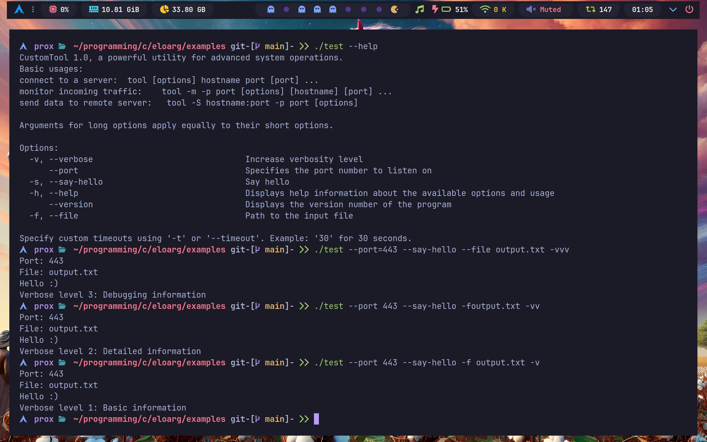

# EloArg: A Lightweight C Library for Command-Line Argument Parsing

EloArg is a **lightweight** and **versatile** command-line argument parser library designed to simplify the process of handling and parsing command-line options in C applications with **modern** and **elegant** syntax.
It provides an intuitive API for defining, parsing, and retrieving command-line arguments with support for short and long options, optional and required arguments, and descriptive help messages.



## 🚀 Features

- **✨ Modern and Elegant Syntax**: Designed with a clean, intuitive, and minimalistic API that makes parsing command-line options straightforward and elegant.
- **🔧 Short and Long Options**: Support for traditional short (`-a`) and long (`--option`) style command-line options, making it flexible and user-friendly.
- **🎯 Optional and Required Arguments**: Define whether an argument is mandatory, optional, or has no associated value, ensuring precise control over input parsing.
- **📖 Descriptive Help Messages**: Automatically generate and display comprehensive help messages with descriptions of all defined options for better usability.
- **🔄 Dynamic Option Management**: Add, modify, and parse options dynamically during runtime, offering exceptional adaptability to various use cases.
- **⚡ Integration with HashTable**: Leverages a high-performance hash table for efficient storage and fast retrieval of parsed options.
- **🛡️ Memory Management Utilities**: Built-in functions to safely allocate, manage, and free memory, minimizing the risk of memory leaks.
 
## Installation

You can use this library either by including the header files and source code locally or by installing it system-wide using the provided Makefile.

#### Option 1: Include Locally
- Clone the repository

    ```Bash
    git clone https://github.com/pr00x/eloarg.git
    cd eloarg
    ```

- Include the header file:

    ```c
    #include "eloarg.h"
    #include "hashtable.h"
    ```

- Compile your program with the library source files:
    Use gcc to compile your program along with eloarg.c and hashtable.c:
    ```Bash
    gcc myprogram.c src/eloarg.c src/hashtable.c -o myprogram
    ```

#### Option 2: Install System-Wide
- Clone the repository:
    Use the Makefile to build and install the library:
    ```Bash
    git clone https://github.com/pr00x/hashtable-c.git
    cd eloarg
    ```
    
- Build and install the library and header file:
    ```Bash
    sudo make install
    ```

    This installs the static library `(libeloarg.a)` to `/usr/local/lib` and the header files `(eloarg.h and hashtable.h)` to `/usr/local/include`.

- Compile your program by linking to the installed library:
    After installation, you can link the library to your program like this:
    ```Bash
    gcc myprogram.c -o myprogram -leloarg
    ```

    Note: The `-leloarg` flag tells the linker to use `libeloarg.a` from the default library directory (/usr/local/lib).

## Uninstallation

If you need to remove the installed library and header files, run:

```Bash
sudo make uninstall
```
This will delete the library and headers from /usr/local/lib and /usr/local/include.

To remove the compiled library and header files from the source directory, run:

```Bash
sudo make clean
```

Uninstall and clean in one command:

```Bash
sudo make clean uninstall
```

## Example
To test the library, you can build and run the included example program:

```Bash
make example
./examples/test
```

## Usage

### Argument Types:

**ARG_INFO**: Used for flags that provide information like --help and --version.

**ARG_REQUIRED**: Indicates mandatory arguments like --port.

**ARG_OPTIONAL**: For optional options with required arguments like --file.

**ARG_NONE**: Used for flags that simply toggle features like --say-hello and --verbose.

```c
#include <stdio.h>
#include <eloarg.h>

int main(int argc, char **argv) {
    EloArg *eloarg = eloArgInit(6);

    eloarg->add("h", "help", "Displays help information about the available options and usage.", ARG_INFO);
    eloarg->add(NULL, "version", "Displays the version number of the program.", ARG_INFO);
    eloarg->add(NULL, "port", "Specifies the port number to listen on.", ARG_REQUIRED);
    eloarg->add("f", "file", "Path to the input file.", ARG_OPTIONAL);
    eloarg->add("s", "say-hello", "Say hello.", ARG_NONE);
    eloarg->add("v", "verbose", "Increase verbosity level.", ARG_NONE);

    eloarg->parse(argc, argv);

    if(eloarg->has("help"))
        eloarg->help("CustomTool 1.0, a powerful utility for advanced system operations.\nBasic usages:\nconnect to a server:  tool [options] hostname port [port] ...\nmonitor incoming traffic:    tool -m -p port [options] [hostname] [port] ...\nsend data to remote server:   tool -S hostname:port -p port [options]\n\nArguments for long options apply equally to their short options.\n"
, "Specify custom timeouts using '-t' or '--timeout'. Example: '30' for 30 seconds.");
    else if(eloarg->has("version")) {
        puts("v1.0.0");

        eloarg->free();
        return 0;
    }

    printf("Port: %s\n", eloarg->get("port"));
    
    if(eloarg->has("file"))
        printf("File: %s\n", eloarg->get("file"));

    if(eloarg->has("say-hello"))
        puts("Hello :)");

    // Handle verbosity levels
    size_t verbosity = eloarg->getCount("v");

    if(verbosity == 0)
        puts("No verbosity: Minimal output");
    else if(verbosity == 1)
        puts("Verbose level 1: Basic information");
    else if(verbosity == 2)
        puts("Verbose level 2: Detailed information");
    else
        puts("Verbose level 3: Debugging information");

    eloarg->free();

    return 0;
}
```

### Full List of Available Arguments (in this example):

| **Short Option** | **Long Option** | **Description**                                           | **Argument Type** |
|:----------------:|:---------------:|:---------------------------------------------------------:|:-----------------:|
| `-h`             | `--help`        | Displays help information about the available options and usage. | `ARG_INFO`        |
| (none)           | `--version`     | Displays the version number of the program.               | `ARG_INFO`        |
| (none)           | `--port`        | Specifies the port number to listen on.                   | `ARG_REQUIRED`    |
| `-f`             | `--file`        | Path to the input file.                                   | `ARG_OPTIONAL`    |
| `-s`             | `--say-hello`   | Say hello.                                                | `ARG_NONE`        |
| `-v`             | `--verbose`     | Increase verbosity level.                                 | `ARG_NONE`        |


### 🚀 Performance and Efficiency

EloArg is designed for fast, efficient, and elegant command-line argument parsing. Key highlights include:

- **⚡ Lightning-Fast Parsing**: Process command-line options with speed and precision, even for large inputs.
- **🔧 Minimal Overhead**: A lightweight design ensures low memory usage and a streamlined implementation without unnecessary dependencies.
- **🔄 Optimized Lookup**: The use of an efficient hash table guarantees quick retrieval of parsed options, ensuring smooth performance.

EloArg delivers modern, high-performance parsing with an elegant, minimalistic approach, making it the perfect choice for efficient and clean command-line handling.

#### EloArg uses a high-performance generic open addressing hash table library in C. You can find more about it [here](https://github.com/pr00x/hashtable-c).

## Author

[@ProX](https://www.github.com/pr00x)

## Contributing

Contributions are welcome! Please create a pull request or submit an issue for any feature requests or bug reports.

## License

This project is licensed under the MIT License. See the `LICENSE` file for details.